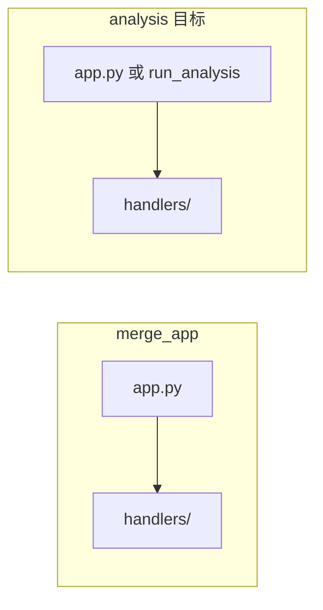

# Analysis 系统开发计划

## 一、引入 Cursor Rules

从 [flyeric0212/cursor-rules](https://github.com/flyeric0212/cursor-rules) 引入规则，使后续开发符合统一规范。

- **做法**：在项目下建立 `.cursor/rules/`（或使用 Cursor 支持的规则目录），按需复制规则文件内容到当前项目，避免依赖外部仓库克隆。
- **建议复制的规则**（与当前技术栈匹配）：
  - **base**：`core.mdc`（核心原则与响应语言）、`project-structure.mdc`（项目结构）。可选：`tech-stack.mdc`、`general.mdc`。
  - **languages**：`python.mdc`（主力为 Python）。
- **说明**：merge_app 使用 Streamlit，cursor-rules 未提供 Streamlit 专用规则，可仅用 Python + base；若后续有 Flask/FastAPI 接口再考虑 `frameworks/flask.mdc` 或 `fastapi.mdc`。

---

## 二、项目架构参考（merge_app）

merge_app 结构可作为 analysis 的参照：




- **merge_app 要点**：[app.py](D:\文件\充电代码工作\merge\merge_app\app.py) 用 Streamlit、侧栏切换功能、`_load_handler` 动态加载 `handlers/*.py`，合并/清洗结果用 session_state 保存并支持 Excel/CSV 下载。
- **analysis 建议**：同样采用 **Streamlit + handlers** 结构，便于与 merge 风格一致，且易于「上传清洗后表」或未来接 DB。

---

## 三、功能范围与优先级


| 功能               | 说明                                                                                                            | 本期            |
| ---------------- | ------------------------------------------------------------------------------------------------------------- | ------------- |
| **功能 2：输出标准化产品** | 按 [prototype.html](file:///C:/Users/HONOR/Desktop/prototype.html) 的数据产品生成表格与图表，支持可下载（表→Excel/CSV，图→PNG/SVG 等） | **先做**        |
| **功能 1：一键入库**    | 傻瓜式一键入库，DB 配置同 [config.py 第 7–11 行](d:\文件\充电代码工作\charging-agent\charging-agent\config.py)，入库结束输出摘要（成功/失败条数）   | **仅预留界面，不连库** |


数据库配置沿用现有约定（环境变量可覆盖）：

- `DB_HOST`（默认 localhost）、`DB_PORT`（默认 3306）、`DB_USER`（默认 root）、`DB_PASSWORD`（默认 caam）、`DB_NAME`（默认 evdata）。

---

## 四、功能 2：输出标准化产品（本期实现）

### 4.1 数据产品与 prototype 对应关系

prototype 为「开放服务平台 - 深度数据」原型，analysis 需能输出其中展示的**数据表**（及配套图表），并支持导出。


| 板块     | 主要输出物                                                 | 导出形式                      |
| ------ | ----------------------------------------------------- | ------------------------- |
| 排行榜    | 存量市场份额 Top10、设施销量 Top10、城市榜 Top10、星级场站榜、型号榜、车企私桩榜 等表格 | 表格 → Excel/CSV            |
| 各运营商数据 | 运营商维度表（设施总量、环比增量、环比增速等）                               | 表格 → Excel/CSV            |
| 全国数据   | 汇总指标卡片 + 近 12 月趋势图 + 各省排名表                            | 表 → Excel/CSV；图 → PNG/SVG |
| 各省数据   | 单省多维度概览表 + 趋势图                                        | 同上                        |
| 核心城市群  | 区域内省份对比表 + 占比图                                        | 表 + 图 可下载                 |
| 功率段分布  | 功率段数量/占比表 + 柱状/饼图                                     | 表 + 图 可下载                 |
| 高速公路建设 | 各省明细表 + 柱状图                                           | 表 + 图 可下载                 |
| 车桩比    | 车桩比指标 + 各省车桩比排名表                                      | 表 → Excel/CSV             |


**初期目标**：优先实现「表格 + 可下载」，图表可先做简单实现（如 Streamlit 内嵌图表 + 导出为 PNG/静态图），与 prototype 展示结构一致即可。

### 4.2 数据来源与计算

- **输入**：清洗后的表（与 merge 输出一致）。本期可通过 **上传 Excel/CSV** 获取；后续可改为从 DB 读取（入库功能接通后）。
- **计算逻辑**：在 handlers 中按「上报机构/运营商、省份、城市、功率段、充电站/桩」等维度聚合，得到：
  - 运营商排名（存量、增量、增速）
  - 城市/省份排名与占比
  - 功率段分布
  - 车桩比（若有车辆或桩数口径）
- **与 merge 的衔接**：字段定义以 [数据格式与入库规范说明.md](D:\文件\充电代码工作\merge\merge_app\数据格式与入库规范说明.md) 及 merge 的 `STANDARD_COLUMNS` / 充电站标准列为准，确保列名一致即可做聚合。

### 4.3 实现步骤（功能 2）

1. **项目骨架**
  - 在 `analysis` 下建立：`app.py`（或 `run_analysis.py`）、`handlers/`、`config.py`（可从 charging-agent 的 config 复制 DB 相关部分，仅用于后续入库；本期不调用 DB）。  
  - 依赖：`streamlit`、`pandas`、`openpyxl`；如需画图可加 `matplotlib`/`plotly`。  
  - 参考 merge_app 的 `requirements.txt`、`.streamlit/config.toml` 配置布局与宽屏等。
2. **侧栏与页面**
  - 侧栏：**「输出标准化产品」**（当前主功能）、**「一键入库」**（仅入口，不连库）。  
  - 主区：默认进入「输出标准化产品」。
3. **输出标准化产品页**
  - **数据入口**：文件上传（Excel/CSV），即「清洗后的表」；可选：报告月份/维度选择（若单文件即单月，可先做固定维度）。  
  - **产品列表**：按 prototype 板块组织（排行榜 / 各运营商 / 全国 / 各省 / 城市群 / 功率段 / 高速 / 车桩比）。  
  - 每个板块：  
    - 展示与 prototype 一致的**数据表**（列名、顺序、含义对齐）；  
    - 提供 **「导出 Excel」/「导出 CSV」** 按钮；  
    - 若有图表，用 Streamlit 图表组件 + 提供 **「下载图表」**（如 PNG）。
  - 实现方式：在 `handlers/` 下按板块或按「排行榜 / 全国 / 省份 / …」拆分子模块，每个子模块负责一至多张表与图的生成与返回，由 `app.py` 调用并渲染。
4. **表格与图表内容**
  - 表格：用 pandas 聚合后得到 DataFrame，列与 prototype 中对应表一致（如排名、运营商/城市/省份、设施总量、市场份额/占比、环比增速等）。  
  - 图表：初期可用简单折线/柱状/饼图（Streamlit + matplotlib 或 plotly），数据与表格同源；导出为 PNG（或 SVG）即可。
5. **文件与命名**
  - 导出文件名建议带日期与板块名，例如：`排行榜_存量市场份额_20260309.xlsx`、`全国数据_各省排名_20260309.csv`。  
  - 图表：`全国数据_近12月趋势_20260309.png` 等。

---

## 五、功能 1：一键入库（仅预留界面）

- **位置**：侧栏单独一项「一键入库」，点击后进入独立页面。  
- **页面内容**：  
  - 简要说明：将清洗后的数据一键写入数据库。  
  - 展示 **数据库配置**（只读或可编辑表单）：host、port、user、database；密码以占位或「已配置」显示，不写明文。  
  - 预留 **「选择清洗后文件」** 与 **「执行入库」** 按钮；**本期不真正连接数据库**，点击「执行入库」可提示「功能开发中」或弹出「摘要」占位（成功 0 / 失败 0）。
- **后续扩展**：真正实现时，读取 config（或本项目的 config.py，与 charging-agent 的 [config.py 第 7–11 行](d:\文件\充电代码工作\charging-agent\charging-agent\config.py) 一致），连接 MySQL，按入库规范写入，并在入库结束后输出摘要（成功条数、失败条数、失败原因摘要）。

---

## 六、目录与文件建议

```
analysis/
├── .cursor/
│   └── rules/                 # 从 cursor-rules 复制的 .mdc 文件
│       ├── core.mdc
│       ├── project-structure.mdc
│       └── python.mdc
├── .streamlit/
│   └── config.toml             # 参考 merge_app
├── handlers/
│   ├── __init__.py
│   ├── ranking_handler.py      # 排行榜多张表
│   ├── operator_handler.py     # 各运营商数据
│   ├── national_handler.py     # 全国数据（卡片+趋势+省表）
│   ├── province_handler.py     # 各省数据
│   ├── citygroup_handler.py    # 核心城市群
│   ├── power_handler.py        # 功率段分布
│   ├── highway_handler.py      # 高速公路建设
│   └── ratio_handler.py        # 车桩比
├── app.py                      # 或 run_analysis.py：Streamlit 入口
├── config.py                   # DB 配置（与 charging-agent 一致，仅入库用）
├── requirements.txt
├── README.md
└── push-to-github.bat          # 已有
```

---

## 七、实施顺序小结

1. **引入 Cursor Rules**：创建 `.cursor/rules/` 并复制 base + python 规则。
2. **搭建 analysis 项目**：`config.py`、`requirements.txt`、`.streamlit/config.toml`、`app.py` + `handlers/` 骨架。
3. **实现功能 2**：数据上传 → 按板块生成表格与图表 → 每板块提供导出（表 Excel/CSV，图 PNG）。
4. **预留功能 1**：入库页 + 配置展示 + 占位按钮与占位摘要，不连 DB。

按此计划可实现「先做功能 2、功能 1 留界面」，并与 merge 及 prototype 对齐；后续接入真实入库与 API 时只需在现有结构上扩展即可。
